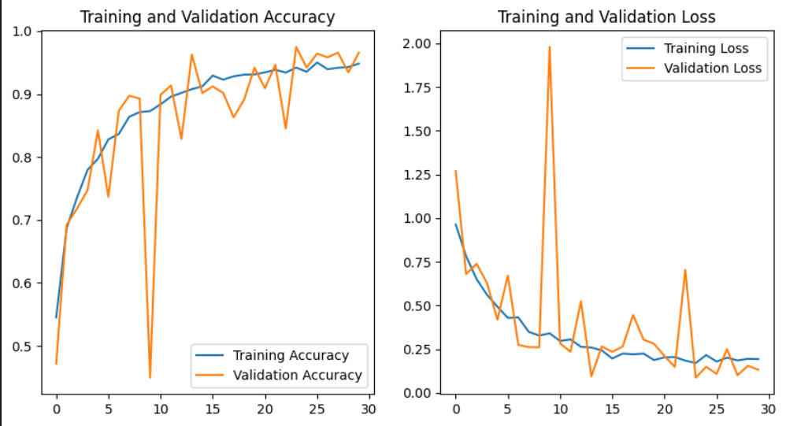
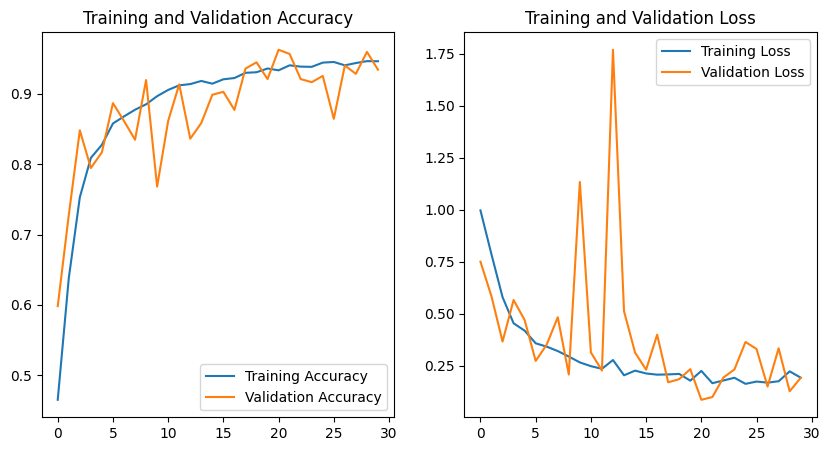

# Tomato Plant Health Classifier 🍅
A deep learning model using CNN to predict the health of tomato plants based on a leaf image. Divided into 3 classes:
1. tomato_early_blight: Indicates the presence of disease symptoms in the tomato plant
2. tomato_healthy: Indicates a healthy tomato plant
3. tomato_late_blight: Indicates that the tomato plant is diseased
  

# Results
### Model 1
 
Accuracy: 94.84% 
Validation Accuracy: 96.58% 
Loss: 19.30% 
Validation Loss: 13.21% 
  

### Model 2
 
Accuracy: 94.65% 
Validation Accuracy: 93.45% 
Loss: 19.31% 
Validation Loss: 19.26% 
  

> Dataset 
https://www.kaggle.com/datasets/arjuntejaswi/plant-village 

> Docker Image:  
https://hub.docker.com/repository/docker/hng011/ai/general

### Notes: 
I utilize only three datasets, which consist of: 

1. Tomato_Early_blight
2. Tomato_Late_blight
3. Tomato_healthy